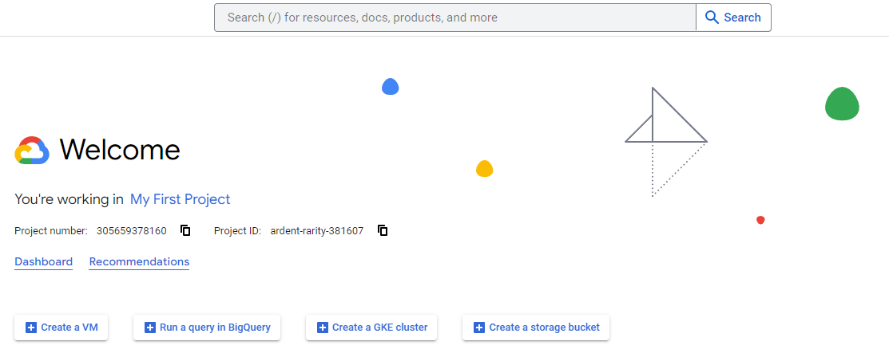
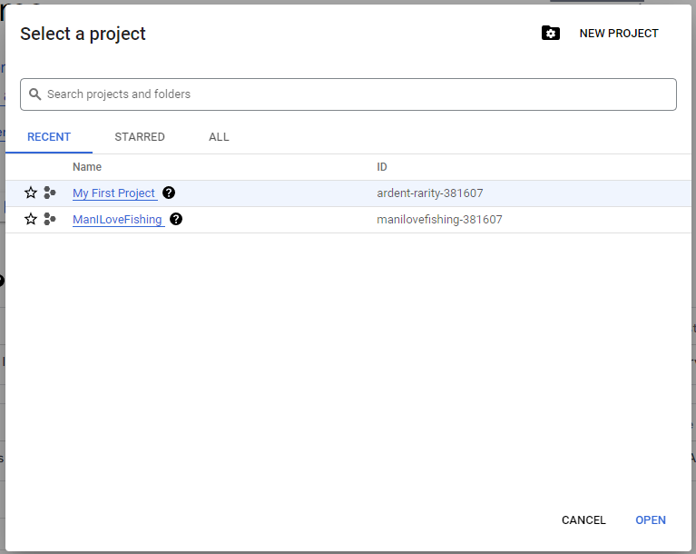
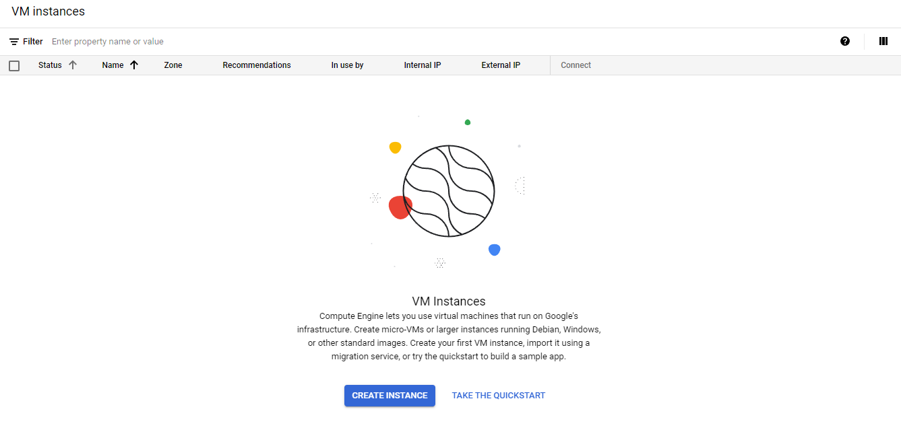
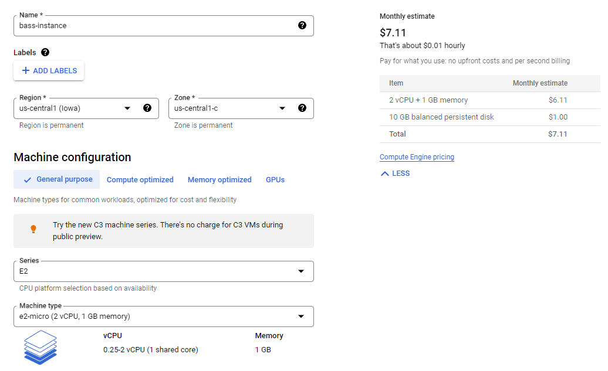
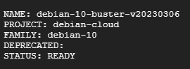
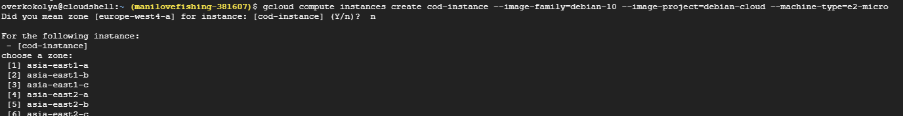
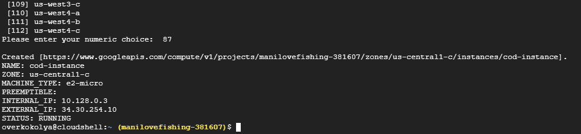
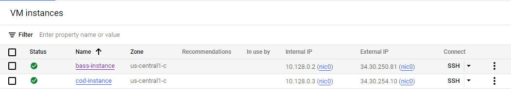

# Мета роботи

Створити віртуальну машину у GCP за допомогою графічного інтерфейсу. Повторити її за допомогою консолі GCP (Cloud Shell).

# Хід роботи

Спочатку було створено акаунт GCP, після чого нас зустрічає сторінка "Welcome".



При натисканні на My first project відкривається меню проектів. Створимо новий за допомогою кнопки NEW PROJECT та виберемо назву ManILoveFishing.



Перейдемо до створення віртуальної машини. Для цього одразу активуємо Compute Engine API та натискаємо на кнопку CREATE INSTANCE.



Обираємо параметри до потреби. В цьому випадку регіон та характеристики обрані найменшої вартості.



Тепер спробуємо повторити за допомогою Cloud Shell. Для цього використаємо команду:

```
gcloud compute images list
```



Нам буде показано всі образи ОС. Оберемо Debian 10. Тепер можна виконати наступну команду:

```
gcloud compute instances create cod-instance --image-family=debian-10 --image-project=debian-cloud --machine-type=e2-micro
```

В консолі з'явився запит щодо регіону. За замовчуванням виставлено europe-west4-a. Повторимо конфігурацію попередньої машини та виставимо us-central1-c, тому на запит відповідаємо "n".



Тепер потрібно знайти необхідний нам регіон у списку. Він знаходиться під номером 87, підтверджуємо та очікуємо на створення машини.



Тобто, машина вже створена. Це можна також підтвердити у графічному інтерфейсі GCP.



Висновок

Після виконаних дій можна сказати, що створити віртуальну машину за допомогою графічного інтерфейсу є набагато легшим (або ж простішим для новачків). Щодо ефективності, то за допомогою Cloud Shell можна створювати безліч машин за мінімальною участю людини. Тобто, графічний інтерфейс можна використовувати для незначної роботи або ознайомлення з GCP, але у крупних проектах використання Cloud Shell або подібних засобів є необхідним.
