# Мета роботи

За допомогою Terraform максимально оптимізувати процес створення віртуальної машини у сабнетворк в новому проекті. Пояснити internal та external IP-адреси.

# Хід роботи

По-перше потрібно встановити terraform. Це можна виконати за допомогою Chocolatey. У Windows PowerShell напишемо таку команду:

```
choco install terraform
```

Підтверджуємо виконання операції та чекаємо встановлення. Після чого можна створювати новий проект у GCP. Було обрано назву "Fish".

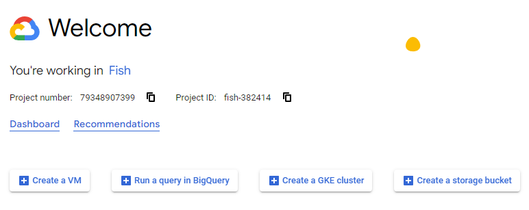

Буде використовуватися Compute Engine API, тому одразу вмикаємо його.

Створимо сервіс акаунт. Для цього перейдемо до вкладки IAM & Admin та виберемо розділ Service Accounts. Натискаємо зверху сторінки кнопку CREATE SERVICE ACCOUNT, вводимо ім'я нового акаунта та тиснемо CREATE AND CONTINUE. Наступні налаштування необов'язкові тому пропускаємо їх. Для акаунта було обрано ім'я "tuna-account". З наступної картинки було стерто OAuth 2 Client ID у цілях безпеки, але не знаю чи це було потрібним.

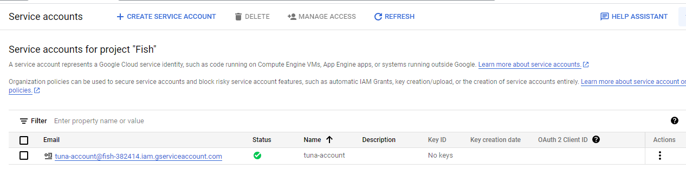

Сформуємо ключ, щоб terraform міг користуватися створеним сервіс акаунтом та взаємодіяти з GCP. Для цього натиснемо на 3 крапки праворуч від назви сервіс акаунта та натиснемо на Manage keys. На відкритій сторінці натискаємо ADD KEY та Create new key. В нашому випадку необхідним буде обрати тип ключа json.

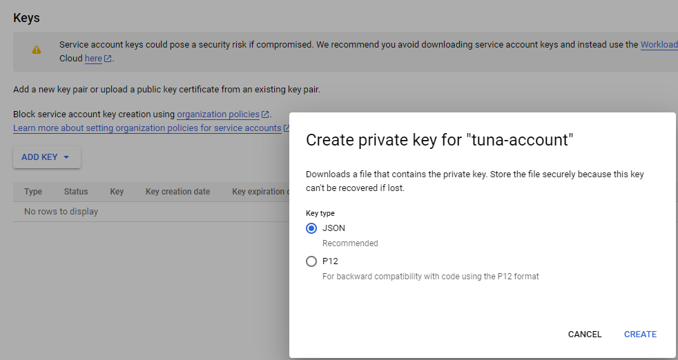

При натисканні CREATE буде завантажено файл з назвою відповідною до проекту та створеного ключа, тому його називати не будемо у цілях безпеки. 

Також, необхідно надати роль створеному сервіс акаунту. Для цього переходимо до "IAM & Admin/IAM" та зверху тиснемо на GRANT ACCESS. В New principals записуємо свій сервіс акаунт і нижче обираємо роль "Basic/Editor".

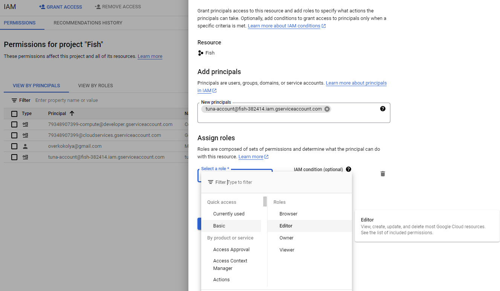

Тепер можна створювати папку, в якій буду зберігатися дані terraform. Перенесемо туди файл ключа та зробимо файл з назвою "main.tf", де буде знаходитись основна частина коду. Відкриємо "main.tf" та запишемо такі рядки.

```
terraform {
  required_providers {
    google = {
      source = "hashicorp/google"
      version = "4.51.0"
    }
  }
}
```

Вказуємо з яким клаудом будемо працювати, в цьому випадку це Google. З сайту hashicorp знаходимо необхідний нам конфіг та вказуємо його у source, також вказуємо необхідну версію.

```
provider "google" {
  credentials = file(var.credentials_file)
  project = var.project
  region  = var.region
  zone    = var.zone
}
```

Надалі вказуємо дані необхідні для роботи, тобто ключ, проект, з яким будемо працювати, регіон та зону. Їх буде записано в окремому файлі "variables.tf", тому до них ще повернемось

```
resource "google_compute_network" "vpc_network" {
  name = "boops-network"
  auto_create_subnetworks = false
}
```

Створюємо мережу у вибраному проекті з назвою "boops-network". За допомогою передостанньої строки виключаємо автоматичне створення сабнетворків.

Тепер створимо сабнетворк.

```
resource "google_compute_subnetwork" "fishing_subnetwork"{
  name = "bass-subnetwork"
  region = var.subnet-region
  network = google_compute_network.vpc_network.name
  ip_cidr_range = "10.0.0.0/16"
}
```

Ім'ям обрано "bass-subnetwork", регіон буде зазначено у файлі "variables.tf". Мережею обираємо раніше створену та вказуємо IP-адресу "10.0.0.0" з маскою підмережі в 16 біт. 

Перейдемо до створення віртуальної машини. По-перше задамо ім'я "cod-instance" та конфігурацію машини "e2-micro". Таку машину обрано задля економії. Додамо можливі теги.

```
resource "google_compute_instance" "vm_instance" {
  name         = "cod-instance"
  machine_type = "e2-micro"
  tags = ["khai", "university", "test", "devops", "group-546", "fishing", "studying", "learning"]
  
  boot_disk {
    initialize_params {
      image = "debian-cloud/debian-11"
    }
  }

  network_interface {
    network = google_compute_network.vpc_network.name
    subnetwork = google_compute_subnetwork.fishing_subnetwork.name
    access_config {
    }
  }
}
```

У розділі boot_disk оберемо бажаний образ операційної системи (Debian 11). Під network_interface задаємо мережу та сабнетворк, створені раніше.

Тепер можна перейти до створення інших файлів, а саме "variables.tf" та "outputs.tf". Вони зберігають змінні та вихідні дані відповідно.

Розглянемо "variables.tf"

```
variable "project" {
    default = "fish-382414"
 }

variable "credentials_file" {
    default = "FILE-NAME.json"
 }

variable "region" {
  default = "us-central1"
}

variable "zone" {
  default = "us-central1-c"
}

variable "subnet-region" {
  default = "us-central1"
}
```

Тут записані усі раніше використані змінні та їх значення за замовчуванням. У прикладі зверху значення змінної "credentials_file" було змінено в цілях безпеки.

Розглянемо "outputs.tf"

```
output "ip" {
  value = google_compute_instance.vm_instance.network_interface.0.network_ip
}
```

Цей код видасть нам IP-адресу машини при виконанні terraform apply.

Тож перейдемо до виконання створених файлів. У Windows PowerShell перейдемо до папки з файлами написаного коду та використаємо команду.

```
terraform init
```

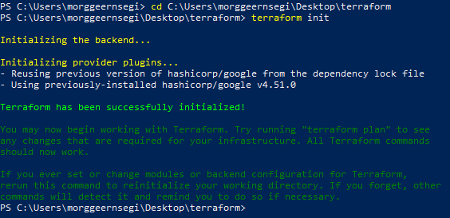

Застосуємо за допомогою

```
terraform apply
```

Нам буде вказано план того, що terraform зробить далі та подано запит на підтверждення операції. Пишемо "yes".

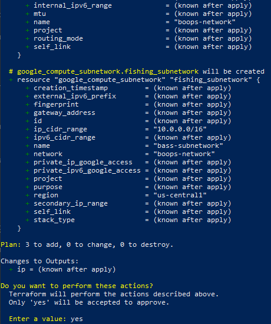

При правильному налаштуванні усі зазначені вище ресурси повинні з'явитись у GCP та у PowerShell з'явитись таке:

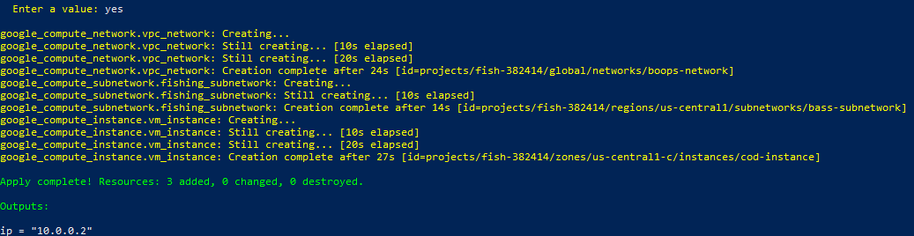

На останньому рисунку також видно нашу internal IP-адресу. Вона використовується для звернення до цього пристрою від інших пристроїв, що належать до тієї ж сабнетворк. До external ip-адреси може звернутися будь-хто з допуском в інтернет. Подивимося на адреси створеної віртуальної машини на сайті GCP.

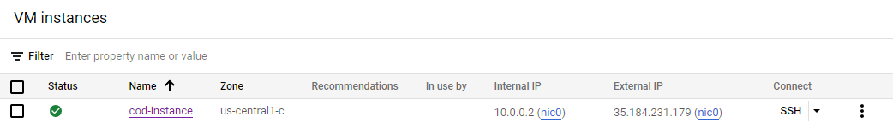

Видно, що вона створилась правильно. Тепер перевіримо інші створені ресурси.

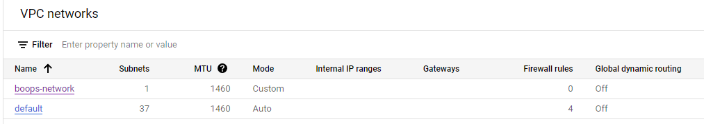

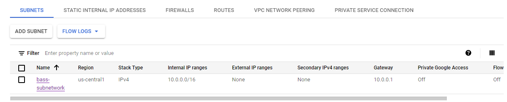

Тобто нетворк та сабнетворк також створено правильно. Останнім кроком залишається знищити все, що було створено. Використаємо команду в Windows PowerShell.

```
terraform destroy
```

При запиті підтвердження пишемо "yes". Ось такий вигляд має вікно PowerShell після операції знищення.

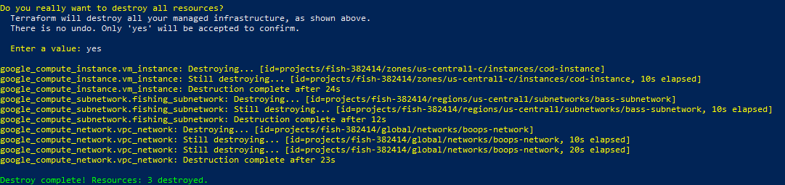

Впевнимося, що знищення пройшло успішно за допомогою перевірки на сайті.

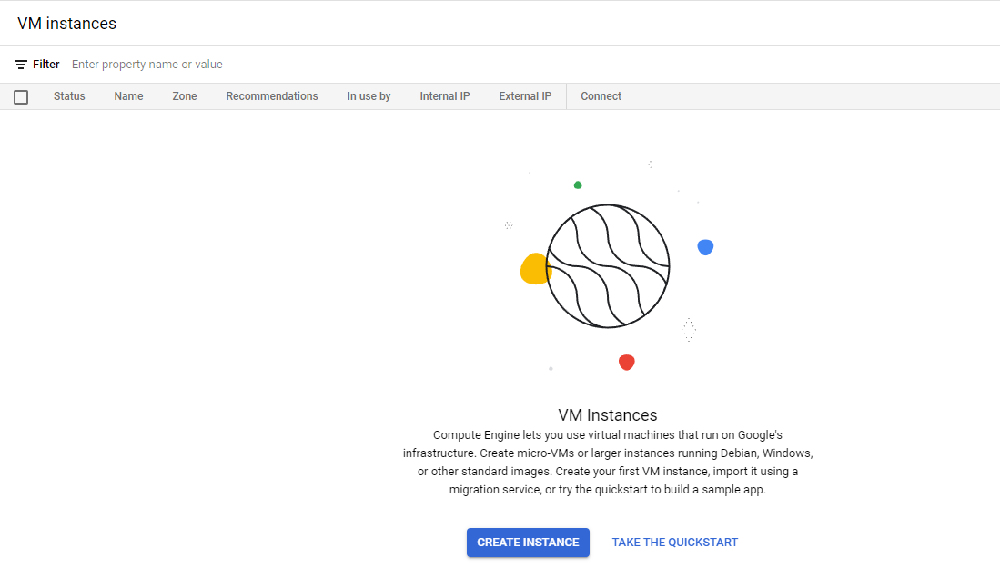

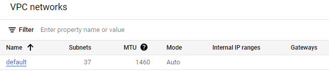

Перевірка пройшла успішно, тому можна вважати, що робота виконана.

Висновок

Terraform використовують, щоб керувати ресурсами різних клауд сервісів за допомогою їх API. Це дозволяє зручно автоматизувати процеси, які цього потребують (наприклад створення мереж або віртуальних машин).
